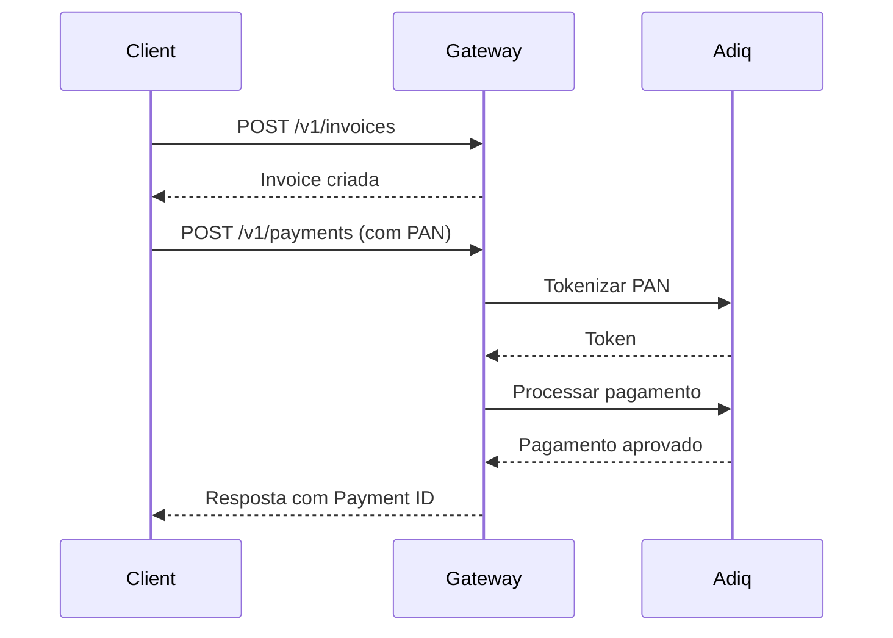

# 📚 Spdpay Gateway - Documentação da API

**Versão:** 1.0.0  
**Base URL:** `http://localhost:8000`  
**Autenticação:** API Key (Header: `X-API-Key`)

---

## 🔐 Autenticação

Todas as requisições (exceto `/health`) requerem autenticação via API Key:

```http
X-API-Key: password
```

---

## 📋 Endpoints

### 1. Health Check

Verifica se a API está funcionando.

**Endpoint:** `GET /health`  
**Autenticação:** Não requerida

**Response:**
```json
{
  "status": "healthy",
  "timestamp": "2025-10-29T17:00:00Z"
}
```

---

### 2. Criar Invoice

Cria uma nova invoice para pagamento.

**Endpoint:** `POST /v1/invoices`  
**Autenticação:** Requerida

**Request Body:**
```json
{
  "merchant_id": "fb93c667-fbab-47ea-b3c7-9dd27231244a",
  "customer_id": "3b415031-7236-425e-bc8f-35c7a5f572ab",
  "amount": 1000,
  "currency": "BRL",
  "description": "Teste de pagamento"
}
```

**Response:**
```json
{
  "id": "uuid-da-invoice",
  "merchant_id": "fb93c667-fbab-47ea-b3c7-9dd27231244a",
  "customer_id": "3b415031-7236-425e-bc8f-35c7a5f572ab",
  "amount": 1000,
  "currency": "BRL",
  "status": "PENDING",
  "description": "Teste de pagamento",
  "created_at": "2025-10-29T17:00:00Z"
}
```

---

### 3. Buscar Invoice

Busca uma invoice pelo ID.

**Endpoint:** `GET /v1/invoices/{invoice_id}`  
**Autenticação:** Requerida

**Response:**
```json
{
  "id": "uuid-da-invoice",
  "merchant_id": "fb93c667-fbab-47ea-b3c7-9dd27231244a",
  "customer_id": "3b415031-7236-425e-bc8f-35c7a5f572ab",
  "amount": 1000,
  "currency": "BRL",
  "status": "PENDING",
  "description": "Teste de pagamento",
  "created_at": "2025-10-29T17:00:00Z",
  "updated_at": "2025-10-29T17:00:00Z"
}
```

---

### 4. Listar Invoices

Lista todas as invoices de um merchant.

**Endpoint:** `GET /v1/invoices?merchant_id={merchant_id}`  
**Autenticação:** Requerida

**Query Parameters:**
- `merchant_id` (obrigatório): ID do merchant

**Response:**
```json
[
  {
    "id": "uuid-da-invoice",
    "merchant_id": "fb93c667-fbab-47ea-b3c7-9dd27231244a",
    "amount": 1000,
    "status": "PENDING",
    "created_at": "2025-10-29T17:00:00Z"
  }
]
```

---

### 5. Criar Pagamento (com Token)

Processa um pagamento usando um token de cartão pré-gerado.

**Endpoint:** `POST /v1/payments/`  
**Autenticação:** Requerida

**Request Body:**
```json
{
  "invoice_id": "uuid-da-invoice",
  "card_token": "TOKEN-DO-CARTAO",
  "brand": "visa",
  "cardholder_name": "JOSE DA SILVA",
  "expiration_month": "12",
  "expiration_year": "25",
  "security_code": "123",
  "installments": 1,
  "capture_type": "ac"
}
```

**Campos:**
- `invoice_id`: UUID da invoice criada
- `card_token`: Token do cartão (gerado previamente)
- `brand`: Bandeira do cartão (`visa`, `mastercard`, `elo`, `amex`, `hipercard`)
- `cardholder_name`: Nome no cartão
- `expiration_month`: Mês de expiração (MM)
- `expiration_year`: Ano de expiração (YY)
- `security_code`: CVV
- `installments`: Número de parcelas (1-12)
- `capture_type`: Tipo de captura (`ac` = auto-captura, `pa` = pré-autorização)

**Response:**
```json
{
  "id": "uuid-da-transacao",
  "invoice_id": "uuid-da-invoice",
  "transaction_id": "uuid-da-transacao",
  "status": "CAPTURED",
  "amount": 1000,
  "installments": 1,
  "authorization_code": "275505",
  "payment_id": "020085619310292014490007157884210000000000",
  "nsu": "123456",
  "tid": "020085619310292014490007157884210000000000",
  "created_at": "2025-10-29T17:00:00Z",
  "updated_at": "2025-10-29T17:00:00Z"
}
```

---

### 6. Criar Pagamento (com PAN)

Processa um pagamento enviando o PAN (número do cartão). O gateway tokeniza automaticamente.

**Endpoint:** `POST /v1/payments/`  
**Autenticação:** Requerida

**Request Body:**
```json
{
  "invoice_id": "uuid-da-invoice",
  "pan": "4761739001010036",
  "brand": "visa",
  "cardholder_name": "JOSE DA SILVA",
  "expiration_month": "12",
  "expiration_year": "25",
  "security_code": "123",
  "installments": 1,
  "capture_type": "ac"
}
```

**Campos:**
- `pan`: Número do cartão (PAN) - será tokenizado automaticamente
- Demais campos iguais ao endpoint com token

**Response:** Igual ao endpoint com token

---

### 7. Buscar Pagamento

Busca um pagamento pelo transaction_id.

**Endpoint:** `GET /v1/payments/{transaction_id}`  
**Autenticação:** Requerida

**Response:**
```json
{
  "id": "uuid-da-transacao",
  "invoice_id": "uuid-da-invoice",
  "merchant_id": "fb93c667-fbab-47ea-b3c7-9dd27231244a",
  "amount": 1000,
  "currency": "BRL",
  "status": "CAPTURED",
  "installments": 1,
  "authorization_code": "275505",
  "payment_id": "020085619310292014490007157884210000000000",
  "nsu": "123456",
  "tid": "020085619310292014490007157884210000000000",
  "created_at": "2025-10-29T17:00:00Z",
  "updated_at": "2025-10-29T17:00:00Z"
}
```

---

## 🎴 Cartões de Teste

### Visa
- **PAN:** 4761739001010036
- **Validade:** 12/25
- **CVV:** 123

### Mastercard
- **PAN:** 5201561050025011
- **Validade:** 12/25
- **CVV:** 123

### Elo
- **PAN:** 5067224275805500
- **Validade:** 11/25
- **CVV:** 123

### Amex
- **PAN:** 376470814541000
- **Validade:** 10/25
- **CVV:** 1234

### Hipercard
- **PAN:** 6062828898541988
- **Validade:** 09/25
- **CVV:** 123

---

## 📊 Status de Pagamento

| Status | Descrição |
|--------|-----------|
| `CREATED` | Transação criada |
| `AUTHORIZED` | Pagamento autorizado (pré-auth) |
| `CAPTURED` | Pagamento capturado (aprovado) |
| `DECLINED` | Pagamento recusado |
| `FAILED` | Falha no processamento |
| `CANCELLED` | Pagamento cancelado |

---

## 🔄 Fluxo Completo



---

## ⚠️ Códigos de Erro

| Código | Descrição |
|--------|-----------|
| 400 | Bad Request - Dados inválidos |
| 401 | Unauthorized - API Key inválida |
| 402 | Payment Required - Falha no pagamento |
| 404 | Not Found - Recurso não encontrado |
| 500 | Internal Server Error - Erro interno |

---

## 🚀 Exemplos com cURL

### Criar Invoice
```bash
curl -X POST http://localhost:8000/v1/invoices \
  -H "X-API-Key: password" \
  -H "Content-Type: application/json" \
  -d '{
    "merchant_id": "fb93c667-fbab-47ea-b3c7-9dd27231244a",
    "customer_id": "3b415031-7236-425e-bc8f-35c7a5f572ab",
    "amount": 1000,
    "currency": "BRL",
    "description": "Teste"
  }'
```

### Criar Pagamento (com PAN)
```bash
curl -X POST http://localhost:8000/v1/payments/ \
  -H "X-API-Key: password" \
  -H "Content-Type: application/json" \
  -d '{
    "invoice_id": "UUID-DA-INVOICE",
    "pan": "4761739001010036",
    "brand": "visa",
    "cardholder_name": "JOSE DA SILVA",
    "expiration_month": "12",
    "expiration_year": "25",
    "security_code": "123",
    "installments": 1,
    "capture_type": "ac"
  }'
```

---

## 📦 Postman Collection

Importe a collection do Postman localizada em:
```
docs/Spdpay_Gateway.postman_collection.json
```

### Variáveis de Ambiente

Crie um environment no Postman com:

```json
{
  "merchant_id": "fb93c667-fbab-47ea-b3c7-9dd27231244a",
  "customer_id": "3b415031-7236-425e-bc8f-35c7a5f572ab",
  "invoice_id": "",
  "transaction_id": "",
  "card_token": ""
}
```

As variáveis `invoice_id` e `transaction_id` são preenchidas automaticamente pelos scripts de teste.

---

## 🔧 Swagger/OpenAPI

Acesse a documentação interativa em:
```
http://localhost:8000/docs
```

Ou a documentação alternativa em:
```
http://localhost:8000/redoc
```

---

## 📝 Notas Importantes

1. **Tokenização Automática:** O gateway aceita tanto `card_token` quanto `pan`. Se `pan` for enviado, o gateway tokeniza automaticamente.

2. **Modelo Subcredenciadora:** Cada merchant deve ter suas próprias credenciais Adiq configuradas no banco de dados.

3. **Antifraude:** A conta Adiq tem antifraude habilitado. O gateway envia dados de cliente dummy para testes.

4. **Tokens Expiram:** Tokens de cartão da Adiq expiram em 10 minutos. Use tokenização automática (PAN) para evitar problemas.

5. **Ambiente:** Atualmente configurado para **Homologação (HML)** da Adiq.

---

## 🆘 Suporte

Para dúvidas ou problemas, consulte:
- `docs/CERTIFICATION.md` - Roteiro de certificação
- `docs/ADIQ_MAPPING.md` - Mapeamento Adiq ↔ Spdpay
- `docs/FLUXO_PAGAMENTO.md` - Fluxo detalhado de pagamento
