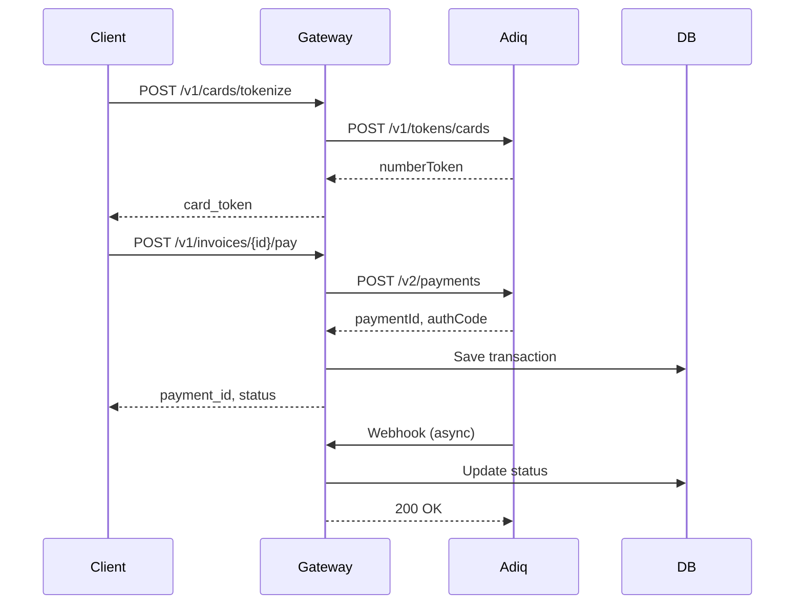

# 📚 Documentação - Spdpay Gateway

Bem-vindo à documentação completa do Spdpay Gateway!

**🔗 Links Úteis:**
- [GitHub Repository](https://github.com/henriqueneves87/spd_gateway)
- [API Documentation](http://localhost:8000/docs) (local)
- [Adiq Developers](https://developers.adiq.io/manual/ecommerce)

---

## 📋 Índice de Documentos

### 🎯 Essenciais

1. **[CONVENTIONS.md](./CONVENTIONS.md)** - Convenções de código e arquitetura
   - Estrutura de pastas
   - Padrões de código
   - Regras PCI
   - Checklist de code review

2. **[SECURITY.md](./SECURITY.md)** - Política de segurança
   - Conformidade PCI DSS
   - Autenticação e autorização
   - Logging seguro
   - Resposta a incidentes

3. **[CONTRIBUTING.md](./CONTRIBUTING.md)** - Guia de contribuição
   - Setup do ambiente
   - Padrões de commits
   - Processo de PR
   - Testes

### 🚀 Implementação

4. **[CERTIFICATION.md](./CERTIFICATION.md)** - Roteiro de certificação Adiq
   - Credenciais de homologação
   - Cartões de teste
   - Roteiro completo de testes
   - Checklist de certificação

5. **[ADIQ_MAPPING.md](./ADIQ_MAPPING.md)** - Mapeamento Adiq ↔ Spdpay
   - Campos de request/response
   - Models internos
   - Estados e transições
   - Regras de armazenamento

### 📦 Recursos

6. **[Adiq.Gateways.Ecommerce.postman_collection.json](./Adiq.Gateways.Ecommerce.postman_collection.json)**
   - Collection Postman completa da Adiq
   - Exemplos de todas as operações
   - Ambientes HML e PRD

7. **[gateway-ecommerce-roteito-testes 3.xlsx](./gateway-ecommerce-roteito-testes%203.xlsx)**
   - Planilha de testes oficial da Adiq
   - Template para certificação

---

## 🎓 Guia de Leitura

### Para Novos Desenvolvedores

1. Leia **[CONVENTIONS.md](./CONVENTIONS.md)** primeiro
2. Configure ambiente seguindo **[CONTRIBUTING.md](./CONTRIBUTING.md)**
3. Entenda segurança em **[SECURITY.md](./SECURITY.md)**
4. Consulte **[ADIQ_MAPPING.md](./ADIQ_MAPPING.md)** ao implementar

### Para Certificação

1. Leia **[CERTIFICATION.md](./CERTIFICATION.md)**
2. Configure credenciais de homologação
3. Execute roteiro de testes
4. Preencha planilha Excel
5. Envie para Adiq

### Para Code Review

1. Verifique **[CONVENTIONS.md](./CONVENTIONS.md)** - Checklist
2. Valide **[SECURITY.md](./SECURITY.md)** - Regras PCI
3. Confirme **[CONTRIBUTING.md](./CONTRIBUTING.md)** - Padrões

---

## 🔍 Busca Rápida

### Preciso saber...

- **Como estruturar código?** → [CONVENTIONS.md](./CONVENTIONS.md)
- **O que posso armazenar?** → [SECURITY.md](./SECURITY.md#dados-proibidos-de-armazenar)
- **Como fazer commit?** → [CONTRIBUTING.md](./CONTRIBUTING.md#estrutura-de-commits)
- **Credenciais Adiq?** → [CERTIFICATION.md](./CERTIFICATION.md#-credenciais-de-homologação)
- **Campos da API Adiq?** → [ADIQ_MAPPING.md](./ADIQ_MAPPING.md)
- **Cartões de teste?** → [CERTIFICATION.md](./CERTIFICATION.md#-cartões-de-teste)
- **Estados permitidos?** → [CONVENTIONS.md](./CONVENTIONS.md#-domínio-de-pagamentos--estados-permitidos)
- **Como reportar bug de segurança?** → [SECURITY.md](./SECURITY.md#-reporte-de-vulnerabilidades)

---

## 📊 Diagramas

### Fluxo de Pagamento



### Arquitetura

```
┌─────────────┐
│   Client    │
└──────┬──────┘
       │
       │ HTTPS
       ▼
┌─────────────────────────────────┐
│      API Layer (FastAPI)        │
│  ┌─────────────────────────┐   │
│  │  /v1/invoices           │   │
│  │  /v1/payments           │   │
│  │  /v1/cards              │   │
│  │  /v1/webhooks           │   │
│  └─────────────────────────┘   │
└────────┬────────────────────────┘
         │
         ▼
┌─────────────────────────────────┐
│     Service Layer               │
│  ┌─────────────────────────┐   │
│  │  InvoiceService         │   │
│  │  PaymentService         │   │
│  │  WebhookService         │   │
│  └─────────────────────────┘   │
└────┬──────────────────┬─────────┘
     │                  │
     ▼                  ▼
┌─────────┐      ┌──────────────┐
│ Supabase│      │    Adiq      │
│   DB    │      │   Adapter    │
└─────────┘      └──────────────┘
```

---

## 🔐 Segurança

### ⚠️ CRÍTICO

**NUNCA armazene:**
- Número do cartão (PAN)
- CVV/CVC
- Data de validade
- Nome impresso no cartão

**Apenas armazene:**
- Token Adiq
- VaultId Adiq
- Brand (bandeira)
- Last4 (últimos 4 dígitos)

Ver detalhes em **[SECURITY.md](./SECURITY.md)**

---

## 🧪 Testes

### Estrutura

```
tests/
├─ unit/              # Testes unitários
├─ integration/       # Testes de integração
├─ certification/     # Testes de certificação Adiq
└─ fixtures/          # Dados de teste
```

### Comandos

```bash
# Todos os testes
pytest

# Com cobertura
pytest --cov=src --cov-report=html

# Apenas certificação
pytest tests/certification/

# Gerar relatório
pytest --html=report.html
```

---

## 📞 Suporte

### Interno

- **Issues:** GitHub Issues
- **Discussões:** GitHub Discussions
- **Segurança:** security@spdpay.com

### Externo

- **Adiq Suporte:** suporte@adiq.io
- **Adiq Docs:** https://developers.adiq.io/manual/ecommerce
- **Supabase:** support@supabase.com

---

## 🔄 Atualizações

Este documento é atualizado conforme o projeto evolui.

**Última atualização:** 2025-10-29

---

## ✅ Checklist Rápido

Antes de começar a codar:

- [ ] Li [CONVENTIONS.md](./CONVENTIONS.md)
- [ ] Li [SECURITY.md](./SECURITY.md)
- [ ] Ambiente configurado ([CONTRIBUTING.md](./CONTRIBUTING.md))
- [ ] Entendo mapeamento Adiq ([ADIQ_MAPPING.md](./ADIQ_MAPPING.md))

Antes de fazer PR:

- [ ] Testes passando
- [ ] Cobertura mantida (>70%)
- [ ] Sem dados sensíveis
- [ ] Logs sanitizados
- [ ] Documentação atualizada

Antes de certificar:

- [ ] Todos os testes de [CERTIFICATION.md](./CERTIFICATION.md)
- [ ] Planilha preenchida
- [ ] Evidências coletadas

---

**Dúvidas? Consulte os documentos ou abra uma issue!**
